# CT Kernel Conversion

Deep learning for converting between CT reconstruction kernels (smooth ↔ sharp) using Fourier-domain operations. The model learns to estimate MTF (Modulation Transfer Function) curves from image PSD (Power Spectral Density) and uses these to transform images between different kernel types.

## Project Structure

```
Code/
├── models/           # Neural network architectures
│   ├── SplineEstimator.py      # Primary: U-Net encoder-decoder + B-spline output
│   ├── KernelEstimator.py      # Encoder-only 256-point radial profile
│   ├── KernelEstimator2d.py    # Full 2D kernel U-Net
│   ├── filterModel.py          # FilterEstimator teacher model
│   ├── Discriminator.py        # GAN discriminator
│   ├── networks.py             # Ablation study models
│   └── stylegan_networks.py    # StyleGAN2-based encoder
├── data/             # Dataset loaders
│   ├── PSDDataset.py           # NIfTI training image pairs
│   ├── Dataset.py              # MTF ground truth loader
│   └── TestDataset.py          # Inference data loader
├── training/         # Training scripts
│   ├── FullTrainLoop.py        # Primary single-GPU training
│   ├── ddpTrain.py             # Distributed DataParallel training
│   ├── ddpTrainAdvaserial.py   # DDP + GAN adversarial training
│   ├── ddpTrainComplexKernel.py # DDP 256-pt distilled training
│   ├── ddpTrainComplexKernel2d.py # DDP 2D filter training
│   ├── train.py                # Legacy training
│   └── train_256.py            # Single-GPU 256-pt training
├── inference/       # Inference scripts
│   ├── reconstruct.py          # Primary inference with SplineEstimator
│   ├── reconstruct_256.py      # Inference with 256-pt model
│   └── reconstruct2d.py        # Inference with 2D kernel model
├── scripts/         # SLURM job launchers
│   ├── train.sh
│   ├── reconstruct.sh
│   └── ddp.sh
├── utils/
│   └── utils.py     # Core signal processing utilities
├── plots/           # Training metrics and diagnostic plots
│   ├── recon_loss.png
│   ├── ft_loss.png
│   └── ...
├── eval/            # Evaluation
│   └── FID.py
├── FourierPhantoms.py  # DICOM processing
└── test.py             # Quick model smoke test
```

## Setup

```bash
uv sync
```

## Training

```bash
# Single GPU
uv run Code/training/FullTrainLoop.py

# With SLURM
sbatch Code/scripts/train.sh
```

## Inference

```bash
uv run Code/inference/reconstruct.py
```

## Pipeline

All model variants share the same core approach: given a pair of CT images reconstructed with different kernels (smooth and sharp), the model learns a Fourier-domain filter that converts one to the other.

```
CT slice (smooth) ─→ PSD ─→ Model ─→ kernel prediction
                                              │
CT slice (sharp)  ─→ PSD ─→ Model ─→ kernel prediction
                                              │
                         smooth kernel ───────┤
                         sharp  kernel ───────┤
                                              │
                              ┌───────────────┘
                              ▼
                    filter = sharp / smooth
                              │
                    FFT(smooth) × filter → IFFT → generated sharp
                    FFT(sharp)  × 1/filter → IFFT → generated smooth
```

1. Compute log-normalized PSD from each input CT slice
2. Model predicts frequency-domain kernel from each PSD
3. Filter ratio = sharp kernel ÷ smooth kernel (pixel-wise)
4. Apply filter via Fourier multiplication: `IFFT(FFT(input) × filter)`

### Models

There are four model architectures in this repo:

#### SplineEstimator (`Code/models/SplineEstimator.py`)

**Architecture**: 8-stage U-Net encoder-decoder → global pooling → FC head → 10 B-spline control points + 6 knot parameters.

**Input**: `(B, 1, 512, 512)` log-normalised PSD.
**Output**: B-spline knots (cubic, 10 internal knots) and 10 control points defining a smooth 1D MTF curve.
**Training**: Image pairs + MTF ground truth. Three losses: reconstruction L1, Fourier-domain Huber, and supervised MTF L1. Loss balance controlled by `alpha`.
**Inference**: Reconstructs MTF curves → converts to 2D OTF via `spline_to_kernel()` → derives filter ratio.

This is the primary model, trained with `FullTrainLoop.py`.

#### KernelEstimator (256-point) (`Code/models/KernelEstimator.py`)

**Architecture**: Encoder-only (8-stage, no decoder) → global pooling → FC → 256-point radial profile.

**Input**: `(B, 1, 512, 512)` PSD.
**Output**: `(B, 256)` — 256 equally-spaced samples of the radial kernel profile (frequency 0 to 1, non-negative, normalized to 1 at DC).
**Training**: Knowledge distillation from a pretrained FilterEstimator teacher.
**Inference**: Radial profile → `radial_to_2d()` → 2D kernel → filter ratio.

A lightweight student model distilled from the 2D filter teacher.

#### KernelEstimator2d (`Code/models/KernelEstimator2d.py`)

**Architecture**: Full 8-stage U-Net (encoder-decoder with skip connections) → 1×1 conv → full-resolution kernel map.

**Input**: `(B, 1, 512, 512)` PSD.
**Output**: `(B, 1, 512, 512)` — full-resolution real-valued positive kernel magnitude.
**Training**: Same knowledge distillation setup as 256-point model, but predicts a full 2D kernel directly. Trained with DDP (`ddpTrainComplexKernel2d.py`).

#### FilterEstimator (`Code/models/filterModel.py`)

**Architecture**: Concatenation encoder (2 input channels: smooth + sharp PSD) → 3-stride-2 conv stages with ResBlocks → decoder → 2 output channels.

**Input**: Two `(B, 1, 512, 512)` PSDs concatenated → `(B, 2, 512, 512)`.
**Output**: `filter_s2sh` and `filter_sh2s` — both `(B, 512, 512)`, directly the filter ratios.
**Training**: Reconstruction L1 only. Trained as a teacher model whose outputs are used as targets for distilling the 256-point and 2D kernel students.

### Training Variants

| Script | Model | Notes |
|--------|-------|-------|
| `FullTrainLoop.py` | SplineEstimator | Single-GPU, image + MTF supervision, alpha-balanced loss |
| `ddpTrain.py` | SplineEstimator | DDP version of FullTrainLoop |
| `ddpTrainAdvaserial.py` | SplineEstimator + Discriminator | DDP + GAN adversarial loss |
| `ddpTrainComplexKernel.py` | KernelEstimator (256-pt) | DDP, knowledge distillation from FilterEstimator |
| `ddpTrainComplexKernel2d.py` | KernelEstimator2d | DDP, same distillation setup, full 2D output |

## Diagnostic Plots

All plots are in `Code/plots/`.

### Training Metrics

Loss curves logged from the training loop (spline model).

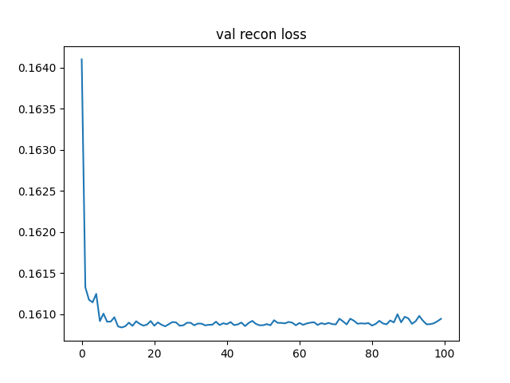
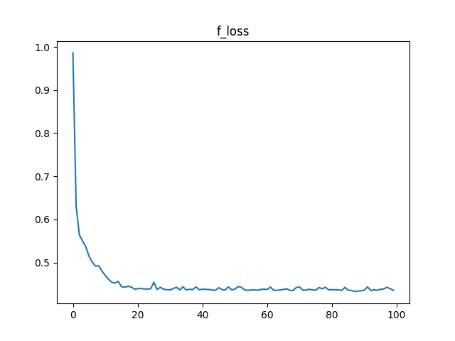
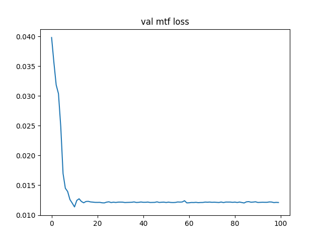
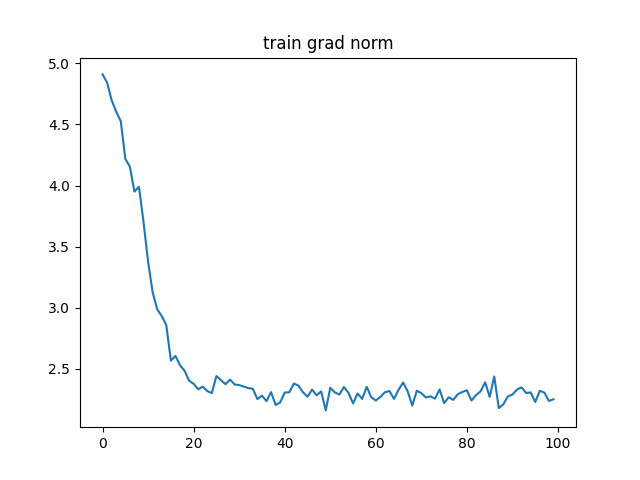

### MTF Curves

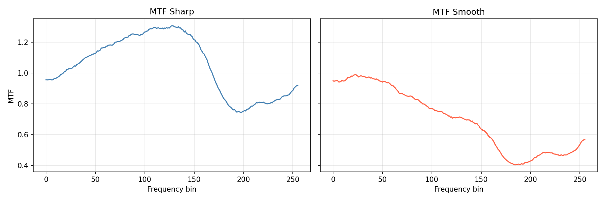
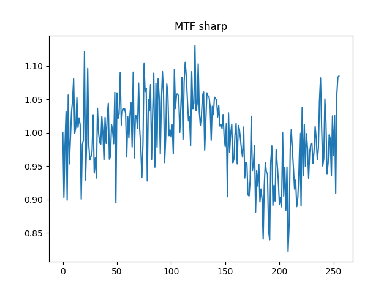
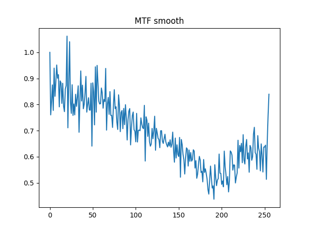

### PSNR

Peak Signal-to-Noise Ratio across model variants, computed on held-out test volumes.

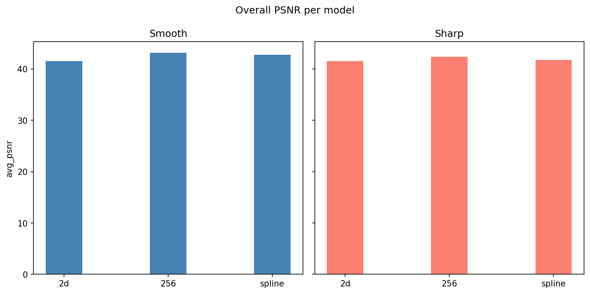
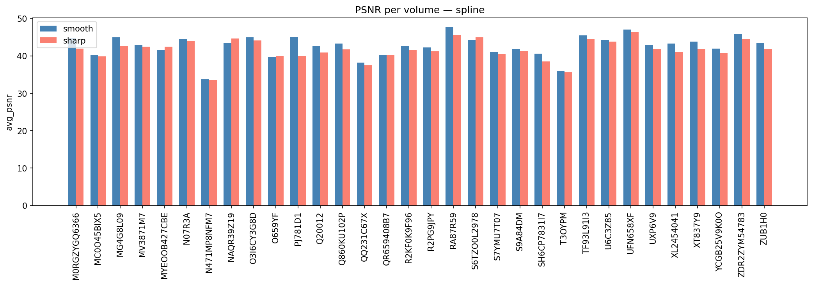
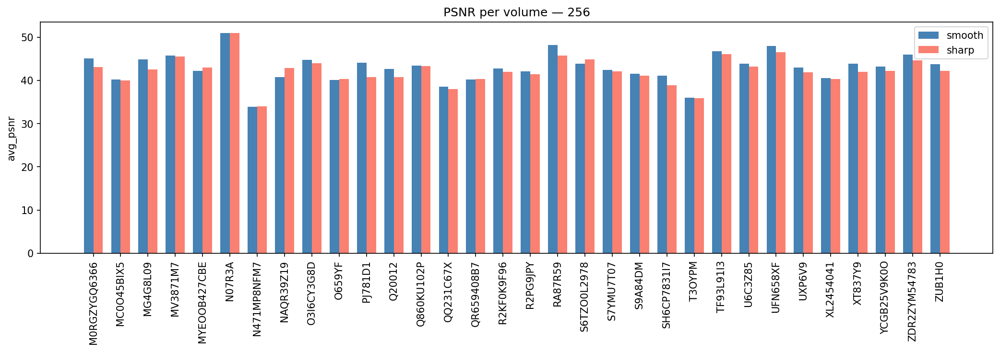
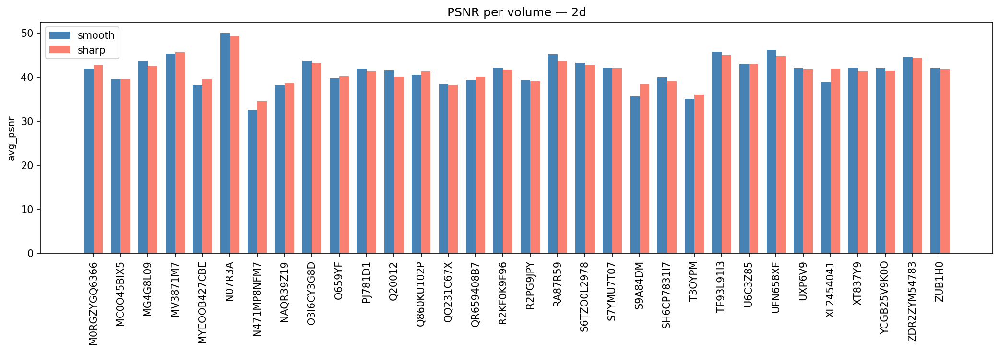

### SSIM

Structural Similarity across model variants.

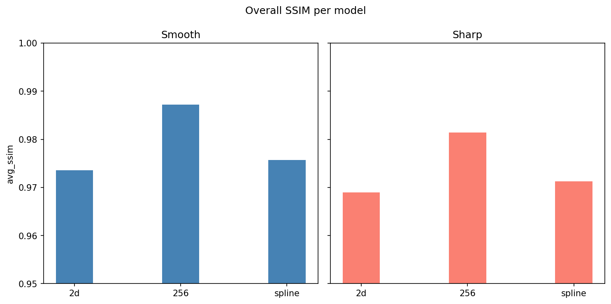

### FID

Fréchet Inception Distance across model variants (lower is better).

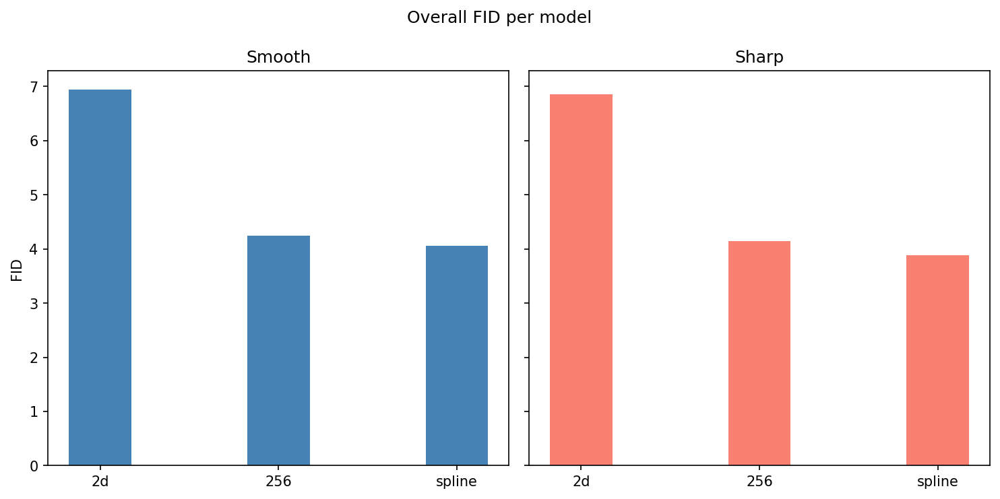
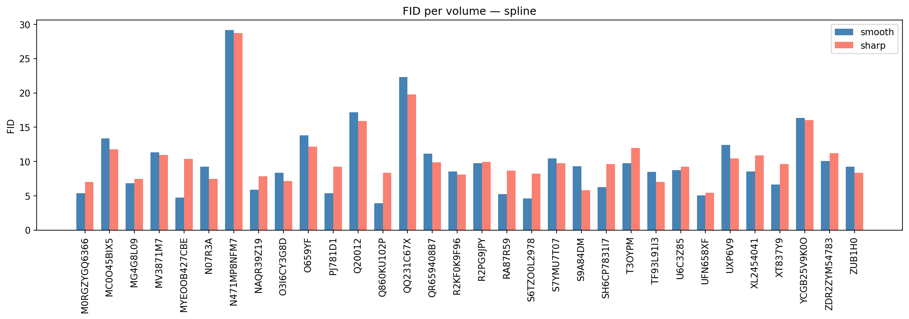
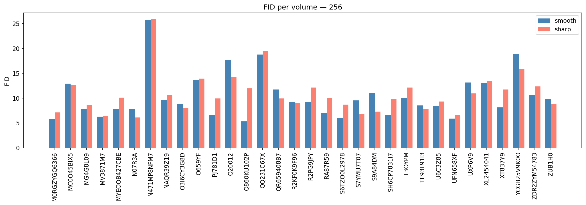
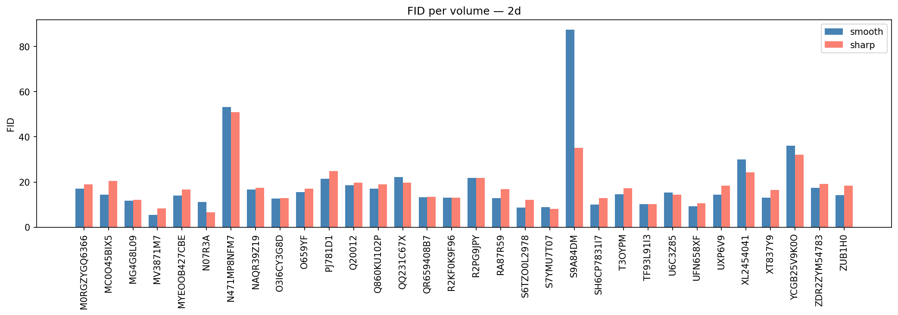

## Kernel Types

Valid reconstruction kernels: `B`, `C`, `CB`, `D`, `E`, `YA`, `YB`

- **Smooth kernels** (B, C): lower high-frequency response
- **Sharp kernels** (D, E): preserve more high-frequency detail
